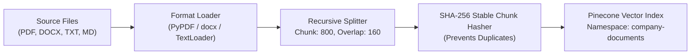

# 🛡️ OpsGuard — Enterprise Incident Response Self-RAG Copilot

<p align="center">
  <strong>Agentic Incident-Response & SRE Copilot Powered by Self-Reflective RAG (Self-RAG), LangGraph Persistent Memory, Pinecone Vector Indexing, Groq LLM Inference, and Tavily Internet Fallback.</strong>
</p>

<p align="center">
  <a href="#-key-features"></a>
  <a href="#-key-features"></a>
  <a href="#-key-features"></a>
  <a href="#-key-features"></a>
  <a href="#-key-features"></a>
  <a href="#-key-features"></a>
  <a href="#-license"></a>
</p>

---

## 📌 Table of Contents

- [Executive Summary](#-executive-summary)
- [The Problem: Why Traditional RAG Fails in Production Ops](#-the-problem-why-traditional-rag-fails-in-production-ops)
- [The Solution: Self-Reflective RAG (Self-RAG)](#-the-solution-self-reflective-rag-self-rag)
- [System Architecture & Visual Diagrams](#-system-architecture--visual-diagrams)
- [LangGraph Decision Flow (StateGraph Breakdown)](#-langgraph-decision-flow-stategraph-breakdown)
- [Key Features](#-key-features)
- [Repository Structure & Deep File Analysis](#-repository-structure--deep-file-analysis)
- [Tech Stack](#-tech-stack)
- [Prerequisites](#-prerequisites)
- [Quickstart Guide](#-quickstart-guide)
- [Environment Configuration (.env)](#-environment-configuration-env)
- [Knowledge Base Ingestion Pipeline](#-knowledge-base-ingestion-pipeline)
- [REST API Reference](#-rest-api-reference)
- [Incident Command Center Web UI](#-incident-command-center-web-ui)
- [Docker & Containerized Deployment](#-docker--containerized-deployment)
- [Evolutionary Research Notebooks (`self_rag/`)](#-evolutionary-research-notebooks-self_rag)
- [Contributing](#-contributing)
- [License](#-license)

---

## 🚀 Executive Summary

**OpsGuard** is an enterprise-grade, agentic incident-response copilot designed for Site Reliability Engineers (SREs), Cloud Engineers, and DevOps teams. During high-severity production incidents (e.g., API 502 spikes, payment gateway timeouts, Kubernetes CrashLoopBackOffs), on-call engineers cannot afford hallucinated commands, out-of-date procedures, or speculative answers.

OpsGuard implements **Self-RAG (Self-Reflective Retrieval-Augmented Generation)** orchestrated via **LangGraph**:
1. **Adaptive Retrieval**: Decides dynamically whether an inquiry requires internal enterprise documentation or general technical knowledge.
2. **Relevance Grading**: Filters retrieved knowledge chunks to discard noise before synthesis.
3. **Cyclical Query Rewriting**: Rewrites queries up to 5 times when initial vector retrieval yields insufficient evidence.
4. **Autonomous Internet Fallback**: Automatically escalates to Tavily internet search when private runbooks do not cover novel or zero-day issues.
5. **Hallucination Verification (`IsSUP`)**: Mathematically and semantically audits generated solutions against cited evidence, actively rewriting until all claims are grounded.
6. **Solution Fit Assessment (`IsUSE`)**: Ensures the answer directly solves the engineer's operational problem.
7. **Thread-Safe Persistent Incident Memory**: Remembers context across multi-turn diagnostic sessions using LangGraph's SQLite checkpointer.

---

## ⚠️ The Problem: Why Traditional RAG Fails in Production Ops

In mission-critical cloud infrastructure, standard (naive) RAG introduces catastrophic operational risks:

| Traditional / Naive RAG Issue | Real-World Production Impact | How OpsGuard Solves It |
| :--- | :--- | :--- |
| **Always-Retrieve Bias** | Queries like *"What is a CIDR block?"* waste latency and fetch irrelevant runbooks. | **Retrieval Routing**: Evaluates whether internal documents are genuinely required or if direct LLM knowledge suffices. |
| **Noise & Distractor Ingestion** | Vector search returns top-$K$ chunks based on surface keywords, introducing misleading SOP steps. | **Relevance Grading**: LLM grader strictly validates each chunk against the specific incident symptom. |
| **Unrecoverable Search Misses** | If initial query embedding misses the runbook, naive RAG generates an answer anyway using bad chunks. | **Cyclical Query Rewriting**: Re-engineers technical search terms up to 5 times to retrieve relevant vectors. |
| **Silent Hallucinations** | Models invent non-existent flags, destructive CLI commands (e.g., `rm -rf`, premature pod deletion), or bogus endpoints. | **IsSUP (Support Grader)**: Validates that every factual statement is explicitly grounded in evidence, triggering automated revisions if unsupported. |
| **Zero-Day / External Blindspots** | If an incident is caused by an external cloud outage (AWS us-east-1, Cloudflare CDN) not documented internally, naive RAG gives up. | **Tavily Web Escalation**: Intelligently switches context to real-time external web search when internal docs are silent. |
| **Amnesiac Troubleshooting** | Engineers asking follow-up questions (*"What was step 3 again?"*) lose incident context. | **Persistent SQLite Memory**: Maintains thread-isolated session checkpoints for continuous incident management. |

---

## 💡 The Solution: Self-Reflective RAG (Self-RAG)

OpsGuard adopts the foundational principles of Self-RAG, injecting explicit reflection tokens and self-evaluative loops into the generation lifecycle:

---

## 🏗️ System Architecture & Visual Diagrams

The core architecture combines FastAPI, LangGraph Self-RAG agent workflow, Pinecone vector store, Groq LLM inference, and Tavily internet fallback. See the decision flow below for the detailed graph architecture.

---

## 🔄 LangGraph Decision Flow (StateGraph Breakdown)

The core engine is structured as a cyclical directed graph compiled with `SqliteSaver` checkpointer:

```mermaid
flowchart TD
    START([START]) --> contextualize[Node: contextualize_question\nMerge Multi-Turn SQLite Memory]
    contextualize --> decide_retrieval{Node: decide_retrieval\nNeed Internal Retrieval?}
    
    decide_retrieval -- FALSE: Generic Technical Query --> direct[Node: generate_direct\nGeneral Technical Answer]
    direct --> commit_memory[Node: commit_memory\nUpdate SQLite Checkpointer]
    
    decide_retrieval -- TRUE: Operational Incident --> retrieve[Node: retrieve_internal\nPinecone Vector Search]
    retrieve --> grade{Node: grade_relevance\nGrade Internal Chunks}
    
    grade -- Evidence Found --> generate[Node: generate_from_context\nSynthesize Incident Response]
    
    grade -- No Relevant Evidence & Retries < 5 --> rewrite_internal[Node: rewrite_internal_query\nOptimize Search Terms]
    rewrite_internal --> retrieve
    
    grade -- Internal Exhausted & Retries >= 5 --> rewrite_web[Node: rewrite_web_query\nCraft Internet Search Query]
    rewrite_web --> web_search[Node: web_search\nTavily Search Engine]
    web_search --> grade
    
    generate --> support{Node: check_support (IsSUP)\nAudit Hallucinations}
    
    support -- Unsupported & Retries < 5 --> revise[Node: revise_answer\nStrip Unsupported Claims]
    revise --> support
    
    support -- Fully Supported or Retries Exhausted --> usefulness{Node: check_usefulness (IsUSE)\nDoes Answer Address Incident?}
    
    usefulness -- Useful --> commit_memory
    usefulness -- Not Useful & Internal Mode --> rewrite_internal
    usefulness -- Not Useful & Web Mode --> rewrite_web
    usefulness -- Exhausted All Attempts --> no_answer[Node: no_answer\nSafe Fallback Notification]
    
    no_answer --> commit_memory
    commit_memory --> END([END: Stream Response to Incident Console])
```

---

## ⚡ Key Features

- **🛡️ Hallucination-Free Operational Guidance**: Every recommendation is validated by the `IsSUP` verification gate against cited runbooks.
- **⚡ Ultra-Low Latency Inference**: Powered by Groq's LPU hardware acceleration (`openai/gpt-oss-120b` or `llama-3.3-70b-versatile`).
- **🌲 Cloud-Native Pinecone Vector Store**: Utilizes integrated serverless embeddings (`llama-text-embed-v2`) with custom namespace isolation (`company-documents`).
- **🌐 Autonomous Tavily Web Escalation**: Falls back to real-time external search when internal documentation lacks coverage for emerging incidents.
- **💾 State-Preserving Incident Memory**: Employs SQLite LangGraph checkpointers (`data/langgraph_memory.sqlite`) so on-call engineers can triage complex issues across multiple turns.
- **📄 Resilient Multi-Format Ingestion**: Ingests PDF, DOCX, Markdown, and TXT files with SHA-256 chunk deduplication to prevent vector clutter.
- **📊 Comprehensive Audit Logging**: Every incident question, synthesized response, execution trace, retrieved sources, and reflection verdict are archived to SQLite (`data/audit.db`).
- **💻 Sleek Operations Console UI**: High-density dark dashboard with live telemetry tags, real-time thinking states, and interactive workflow inspection.

---

## 📂 Repository Structure & Deep File Analysis

```text
OpsGuard/
├── app.py                     # FastAPI server, API endpoints, static mounting & threadpool dispatch
├── data_ingestion.py          # Standalone CLI ingestion pipeline for runbooks and SOPs
├── Dockerfile                 # Multi-stage production container setup (Python 3.11-slim)
├── docker_compose.yml         # Container orchestration configuration
├── .dockerignore              # Excludes secrets, git, and virtualenvs from Docker image
├── .gitignore                 # Enforces security boundaries (.env, databases, local uploads)
├── .env.example               # Complete environment variable configuration template
├── requirements.txt           # Production package dependencies
├── requirements-lock.txt      # Fully pinned dependency lockfile
├── steps.md                   # System design roadmap and architecture verification checklist
├── template.py                # Automated directory and file scaffolding script
├── test.py                    # Diagnostic smoke test for vector store and credentials
│
├── src/                       # Core application source code
│   ├── __init__.py            # Module marker
│   ├── config.py              # Centralized Pydantic Settings and environment validation
│   ├── models.py              # Pydantic data schemas (ChatRequest, ChatResponse, SourceItem, etc.)
│   ├── db.py                  # SQLite audit trail manager for incident logs
│   ├── vectorstore.py         # Pinecone index lifecycle, integrated embeddings, and retriever
│   ├── ingestion.py           # Multi-format document loader, text chunker, and deduplicator
│   └── self_rag.py            # Complete LangGraph Self-RAG cyclical graph implementation
│
├── templates/
│   └── index.html             # Jinja2 template for the Incident Command Center web dashboard
│
├── static/
│   ├── app.js                 # Frontend state controller, WebSocket/HTTP client, and trace renderer
│   └── style.css              # Custom dark-theme CSS design system with noise overlays
│
├── documents/                 # Sample internal production runbooks and SOPs
│   ├── checkout-api-runbook.md        # Runbook for Checkout API 502 errors & Kubernetes checks
│   ├── deployment-rollback-sop.md     # Standard operating procedure for deployment rollbacks
│   └── payments-high-cpu-runbook.md   # Runbook for high CPU utilization on payment workers
│
├── docs/                      # Enterprise supplemental documentation
│   ├── Company_Policies.pdf           # Internal HR and security policies
│   ├── Company_Profile.pdf            # Organizational architecture overview
│   └── Product_and_Pricing.pdf        # Product catalog and SLA tier definitions
│
├── pictures/                  # Architecture, flowchart, and technical diagrams
│   ├── ProjectRealArchitecture1.png   # End-to-end production architecture diagram
│   ├── architecture.png               # High-level component flowchart
│   ├── BasicRag.png                   # Traditional naive RAG diagram
│   ├── BasicRagLimitation.png         # Naive RAG limitations and hallucination modes
│   ├── SelfRag.png                    # Self-RAG conceptual framework
│   ├── SelfRagBehaviour.png           # Self-RAG behavioral state transitions
│   ├── selfragtech.png                # Core technologies powering the Self-RAG graph
│   └── Techstack.png                  # Enterprise technology breakdown
│
├── self_rag/                  # Evolutionary research and development Jupyter notebooks
│   ├── self_rag_step.ipynb            # Step 1: Base retrieval and basic generation
│   ├── self_rag_step2.ipynb           # Step 2: Document relevance grading
│   ├── self_rag_step3.ipynb           # Step 3: Query rewrite logic
│   ├── self_rag_step4.ipynb           # Step 4: Web search fallback integration
│   ├── self_rag_step5.ipynb           # Step 5: IsSUP hallucination and grounding check
│   ├── self_rag_step6.ipynb           # Step 6: IsUSE solution usefulness check
│   ├── self_rag_web.ipynb             # Standalone web search verification experiments
│   └── self_rag_final.ipynb           # Final compiled stateful Self-RAG pipeline
│
├── data/                      # Local persistent runtime storage (Excluded from git)
│   ├── audit.db                       # SQLite audit trail of all historical queries & traces
│   └── langgraph_memory.sqlite        # SQLite checkpoint database for persistent thread memory
│
└── uploads/                   # Temporary staging area for user-uploaded documents (Excluded from git)
    └── .gitkeep               # Directory placeholder
```

---

## 🛠️ Tech Stack

| Layer | Technology | Purpose |
| :--- | :--- | :--- |
| **Application Server** | [FastAPI](https://fastapi.tiangolo.com/) + [Uvicorn](https://www.uvicorn.org/) | Asynchronous high-performance REST API and web server |
| **Agentic Framework** | [LangGraph](https://www.langchain.com/langgraph) | Cyclic graph state machine for multi-step agent reasoning |
| **LLM Inference** | [Groq](https://groq.com/) (`openai/gpt-oss-120b` / `llama-3.3-70b`) | Ultra-fast token generation and structured JSON schema output |
| **Vector Database** | [Pinecone](https://www.pinecone.io/) Serverless | Managed cloud vector database with `llama-text-embed-v2` |
| **External Search** | [Tavily Search API](https://tavily.com/) | Real-time search engine optimized for AI agents |
| **Persistent Memory** | [LangGraph SQLite Checkpointer](https://github.com/langchain-ai/langgraph) | Multi-turn incident state and conversational context |
| **Audit Storage** | [SQLite3](https://www.sqlite.org/) | Structured incident audit trail (queries, routes, traces, citations) |
| **Document Parsing** | PyPDF, python-docx, Unstructured | Multi-format parsing for PDF, DOCX, TXT, and Markdown |
| **Frontend UI** | HTML5, Vanilla JavaScript, CSS3 | SRE command console with live trace inspection |
| **Deployment** | Docker & Docker Compose | Containerized reproducible execution |

---

## 📋 Prerequisites

Before running OpsGuard, ensure you have:
1. **Python 3.11+** installed.
2. A **[Groq API Key](https://console.groq.com/keys)** for high-speed inference.
3. A **[Pinecone API Key](https://app.pinecone.io/)** for serverless vector indexing.
4. A **[Tavily API Key](https://app.tavily.com/)** for internet search fallback.

---

## 🚀 Quickstart Guide

### 1. Clone the Repository
```bash
git clone https://github.com/SoumyaRM2004/OpsGuard_Copilot.git
cd OpsGuard_Copilot
```

### 2. Set Up Virtual Environment

Using standard Python `venv`:
```bash
python -m venv .venv

# On Linux / macOS:
source .venv/bin/activate

# On Windows (PowerShell):
.venv\Scripts\Activate.ps1
```

*Or using `uv` for high-speed dependency resolution:*
```bash
uv venv
.venv\Scripts\Activate.ps1
```

### 3. Install Dependencies
```bash
pip install -r requirements.txt
```

### 4. Configure Environment Variables
Copy the template file to `.env`:
```bash
cp .env.example .env
```
Edit `.env` and fill in your API credentials (see [Environment Configuration](#-environment-configuration-env) below).

### 5. Ingest Internal Runbooks & Documents
Populate your Pinecone index with the initial runbooks from `documents/`:
```bash
python data_ingestion.py
```
*Expected Output:*
```text
====================================================================
OpsGuard Sentinel - Pinecone Knowledge Base Ingestion
====================================================================
Groq model             : openai/gpt-oss-120b
Pinecone index         : opsguard
Pinecone namespace     : company-documents
Embedding model        : llama-text-embed-v2
Documents directory    : D:\Project\OpsGuard\documents

[1/2] Pinecone index is ready.
[2/2] Ingesting 3 document(s)...
      - checkout-api-runbook.md
      - deployment-rollback-sop.md
      - payments-high-cpu-runbook.md

Knowledge base is ready.
Indexed chunks: 14
Index: opsguard
Namespace: company-documents
```

### 6. Launch the Application
```bash
python app.py
```
Or directly with Uvicorn:
```bash
uvicorn app:app --host 0.0.0.0 --port 8080 --reload
```
Open your browser and navigate to: **`http://localhost:8080`**

---

## ⚙️ Environment Configuration (.env)

| Variable | Default Value | Description |
| :--- | :--- | :--- |
| `GROQ_API_KEY` | *(Required)* | Groq API Key for LLM inference |
| `GROQ_MODEL` | `openai/gpt-oss-120b` | Groq model (`openai/gpt-oss-120b`, `llama-3.3-70b-versatile`) |
| `PINECONE_API_KEY` | *(Required)* | Pinecone API key |
| `PINECONE_INDEX_NAME` | `opsguard` | Pinecone index name |
| `PINECONE_NAMESPACE` | `company-documents` | Isolation namespace for operational runbooks |
| `PINECONE_CLOUD` | `aws` | Cloud provider for serverless index (`aws`, `gcp`, `azure`) |
| `PINECONE_REGION` | `us-east-1` | Cloud region for serverless index |
| `PINECONE_EMBEDDING_MODEL`| `llama-text-embed-v2` | Integrated embedding model |
| `TAVILY_API_KEY` | *(Required)* | Tavily API Key for fallback internet search |
| `TOP_K` | `5` | Number of document chunks retrieved per query |
| `MAX_SUPPORT_RETRIES` | `5` | Maximum corrective revisions if `IsSUP` fails |
| `MAX_RETRIEVAL_REWRITES`| `5` | Maximum internal vector query rewrites |
| `MAX_WEB_REWRITES` | `3` | Maximum internet search query rewrites |
| `DATABASE_PATH` | `data/audit.db` | Path to SQLite incident audit database |
| `LANGSMITH_TRACING` | `false` | Enable LangSmith observability |
| `LANGSMITH_API_KEY` | *None* | LangSmith API Key |
| `LANGSMITH_PROJECT` | `OpsGuard` | LangSmith project name |

---

## 📥 Knowledge Base Ingestion Pipeline

The ingestion engine (`src/ingestion.py`) handles multi-format document loading and chunking:



### Supported Document Types
- **Markdown (`.md`)**: Runbooks, postmortems, architecture documentation.
- **PDF (`.pdf`)**: Vendor whitepapers, compliance manuals, corporate policies.
- **Word (`.docx`)**: Operational SOPs and incident reports.
- **Text (`.txt`)**: Configuration templates and system logs.

### Adding New Documents
1. **Via CLI**: Drop files into `documents/` and run `python data_ingestion.py`.
2. **Via UI**: Click **Runbook Vault** in the web dashboard, select a file, and click **Add to knowledge base** for live indexing without server restart.

---

## 🔌 REST API Reference

### 1. Healthcheck
```http
GET /api/health
```
**Response:**
```json
{
  "status": "ok",
  "service": "opsguard-self-rag"
}
```

---

### 2. Chat (Self-RAG Incident Investigation)
```http
POST /api/chat
Content-Type: application/json
```
**Request Body:**
```json
{
  "question": "Our checkout API is returning 502 errors after deployment. What should the on-call engineer check first?",
  "thread_id": "incident-8c7a-429f"
}
```
**Response Body:**
```json
{
  "answer": "According to the Checkout API Production Runbook, when 502 responses begin immediately after a release, follow this sequence:\n1. Compare incident start time with the latest deployment timestamp.\n2. Check Kubernetes deployment and pod status for checkout-api.\n3. Inspect readiness-probe failures before restarting pods. A pod failing readiness must not receive traffic.\n4. Review the latest application logs for startup or configuration errors.\n5. Verify required environment variables and secrets.\n6. Check connectivity to Payment Gateway and Orders database.\n7. If errors persist above 5% for 5 minutes, trigger the deployment rollback SOP.\n\nCAUTION: Do not delete pods repeatedly as a first response.",
  "route": "Private Runbooks",
  "used_web_search": false,
  "support_status": "fully_supported",
  "usefulness": "useful",
  "sources": [
    {
      "type": "internal",
      "title": "checkout-api-runbook.md",
      "source": "d:\\Project\\OpsGuard\\documents\\checkout-api-runbook.md",
      "url": null,
      "page": null
    }
  ],
  "trace": [
    "Memory: new incident session",
    "Retrieval decision: True",
    "Internal retrieval: 5 chunks",
    "Relevance grade (internal): 3/5 relevant",
    "Generated answer from internal evidence",
    "Support check: fully_supported",
    "Usefulness check: useful",
    "SQLite memory checkpoint updated"
  ],
  "thread_id": "incident-8c7a-429f",
  "memory_turns": 1
}
```

---

### 3. Upload & Index Document
```http
POST /api/upload
Content-Type: multipart/form-data
```
**Request:**
```bash
curl -X POST http://localhost:8080/api/upload \
  -F "file=@/path/to/incident_sop.pdf"
```
**Response:**
```json
{
  "filename": "incident_sop.pdf",
  "chunks_indexed": 12,
  "namespace": "company-documents"
}
```

---

### 4. Audit History
```http
GET /api/audits?limit=20
```
**Response:**
Returns the last $N$ incident queries with complete execution traces, route classification, web search flags, and grounding scores stored in `data/audit.db`.

---

## 🖥️ Incident Command Center Web UI

The built-in web frontend provides a high-density, mission-critical workspace:
- **Real-Time Telemetry Tags**: Visual tags indicating route (`Private Runbooks`, `Internet Search`, or `General Knowledge`), `IsSUP` grounding status, `IsUSE` usefulness grade, and SQLite memory turns.
- **Workflow Trace Inspector**: Expandable step-by-step diagnostic trace revealing every decision the LangGraph state machine took.
- **Incident Starter Scenarios**: Quick-launch buttons for typical P1/P2 scenarios (e.g., 502 deployment failures, high CPU alerts, CrashLoopBackOffs).
- **Runbook Vault Upload Dropzone**: Ingest new SOPs directly from the browser with instant status feedback.
- **Session Memory Manager**: Create isolated incident sessions with persistent memory tracking.

---

## 🐳 Docker & Containerized Deployment

### Option A: Using Docker Compose (Recommended)
Launch the complete stack with a single command:
```bash
docker compose up --build -d
```
Stop the container:
```bash
docker compose down
```

### Option B: Using Docker CLI
Build the production container:
```bash
docker build -t opsguard-copilot:latest .
```
Run the container:
```bash
docker run -d \
  --name opsguard \
  -p 8080:8080 \
  --env-file .env \
  -v "$(pwd)/data:/app/data" \
  -v "$(pwd)/uploads:/app/uploads" \
  opsguard-copilot:latest
```

---

## 🔬 Evolutionary Research Notebooks (`self_rag/`)

The `self_rag/` directory documents the iterative research journey and algorithmic evolution from naive RAG to the final self-reflective graph:

1. **`self_rag_step.ipynb`**: Baseline LangChain retrieval and generation setup.
2. **`self_rag_step2.ipynb`**: Implementation of LLM document relevance grading to eliminate distractors.
3. **`self_rag_step3.ipynb`**: Query rewrite loops for recovering from poor semantic vector matches.
4. **`self_rag_step4.ipynb`**: Integration of Tavily search API as an autonomous fallback mechanism.
5. **`self_rag_step5.ipynb`**: Introduction of `IsSUP` (Support Grader) and automated corrective answer revision.
6. **`self_rag_step6.ipynb`**: Integration of `IsUSE` (Usefulness Grader) and conversational loopback.
7. **`self_rag_web.ipynb`**: Evaluation and benchmarking of Tavily search depth and recency filters.
8. **`self_rag_final.ipynb`**: Complete standalone notebook consolidating the production LangGraph state graph.

---

## 🤝 Contributing

Contributions are welcome! To contribute:
1. Fork the repository (`https://github.com/SoumyaRM2004/OpsGuard_Copilot`).
2. Create a feature branch (`git checkout -b feature/amazing-feature`).
3. Commit your changes (`git commit -m 'feat: add amazing feature'`).
4. Push to the branch (`git push origin feature/amazing-feature`).
5. Open a Pull Request.

---

## 📄 License

Distributed under the **MIT License**. See [`LICENSE`](LICENSE) for details.

```text
Copyright (c) 2026 Soumyaranjan Mohapatra
```
